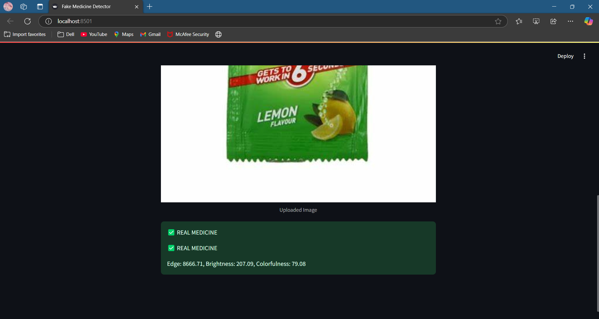

# 🛡️ PharmaShield – Fake Medicine Detector

**PharmaShield** is a simple and fast app that helps detect fake medicine packaging by analyzing visual features like edge sharpness, brightness, and color variation.  
No machine learning, datasets, or external training required — just upload an image and get real-time results.

---

## 🚀 Features

- 🧠 Detects fake medicine packaging using visual analysis
- ⚡ Lightweight — no dataset or training needed
- 🖼️ Evaluates:
  - Edge sharpness (variance)
  - Brightness levels
  - Color variation
- 🌐 Interactive web interface using **Streamlit**
- 📦 Minimal dependencies

---

## 📦 Tech Stack

- Python 3
- Streamlit
- Pillow (PIL)
- NumPy
- SciPy

---

## 💡 How It Works

1. Upload a medicine image (like a blister or packaging).
2. The app calculates:
   - **Edge variance** — overly sharp = possibly fake
   - **Brightness** — too dark or bright = suspicious
   - **Colorfulness** — low variation = faded or counterfeit
3. If edge variance is **above 10,000**, it's immediately flagged as **FAKE**.
4. If multiple features look suspicious, it also flags the image as **FAKE**.

---

## 🖥️ Run Locally

### 1. Clone the repo
```bash
git clone https://github.com/abinayagoudjandhyala/Pharma_Shield.git
cd Pharma_Shield
```

### 2. Install dependencies
```bash
pip install -r requirements.txt
```

### 3. Launch the app
```bash
python -m streamlit run app.py 
```

Then open your browser at `http://localhost:8501`

---

## 📁 Project Structure

```
pharmashield/
├── app.py               # Streamlit frontend
├── image_model.py       # Image analysis logic
├── requirements.txt     # Dependencies
├── README.md            # Project description
```

---

## 🧪 Sample Output

- ✅ Real: Clean, consistent edge variance and colors
- ❌ Fake: Abnormally sharp, faded, or suspicious lighting



---

## 📋 requirements.txt

```
streamlit
Pillow
numpy
scipy
```

---

## 📌 Notes

- This project is designed for simple edge-based detection.
- It does **not** require or use any machine learning model.
- Works best with clear, front-facing images of packaging.

---
